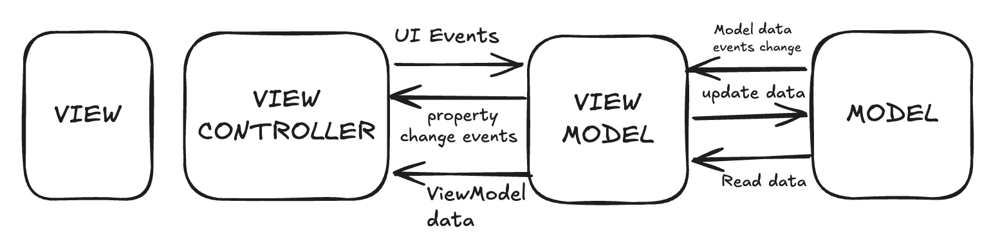

# myNaksh

A chat screen for an astrology app, built with React Native. It looks and behaves
like a messaging thread: you talk to an AI astrologer, a human astrologer can chime
in, messages group by sender, and some AI replies carry recommendation cards
(gemstones, tarot, consultations, and so on).

Stack: React Native 0.87, TypeScript, Redux Toolkit, React Navigation, Reanimated,
and react-native-svg for the icons and card visuals.

## Getting started

```bash
npm install

# iOS (needs CocoaPods)
cd ios && pod install && cd ..
npm run ios

# Android
npm run android

# tests
npm test
```

One thing to know: react-native-svg has native code. If you add it (or any native
library) and only reload Metro, you'll hit errors like "can't find view manager
RNSVGPath". Rebuild the app after `pod install` instead of just restarting Metro.

## Project structure

The code lives in `src/` and is organised by MVVM layer rather than by feature.

```
src/
  models/              the data layer
    store/             Redux store, slices, selectors, typed hooks
    services/          mock backend (conversationService) + seed data
    types/             domain types (Message, Recommendation, ...)
  viewmodels/          the bridge between state and the UI
  controllers/         thunks that do the work (send, retry, feedback, ...)
  views/               everything on screen
    screens/           ConversationScreen + loading/error/empty states
    components/         MessageList, Composer, Header, action sheet, toast, ...
      messages/        one component per message type + a registry
      recommendations/ recommendation card, carousel, and its registry
      icons/           SVG icons
  theme/               colours, spacing, radii, typography
  utils/               grouping, time formatting, id, constants
  navigation/          the navigation stack
```

## Component architecture

`ConversationScreen` is the only screen. It reads one object from the view model and
decides what to show: a loading state while the thread loads, an error state if the
load fails, an empty state if there are no messages yet, otherwise the chat itself.
Those four states live in `views/screens/states/`.

The chat is a `FlatList` (`MessageList`). Each row can be a different kind of message,
so instead of a big `if/else` the list uses a small registry
(`views/components/messages/registry.tsx`) that maps a message type to its component:

- `UserMessage` — what you send, with a sending/sent/failed status and a retry button
- `AiMessage` — the AI reply, which may include recommendation cards and like/dislike
- `HumanMessage` — a human astrologer's reply
- `SystemMessage` — centred system notices
- `DateSeparator` — the date divider between days

Components under `views/components/` are presentational. They take props and render;
they don't touch the store, services, or thunks. That keeps them easy to read and test.

## State management

State is held in Redux Toolkit, split into two slices:

- `conversationSlice` — the real data: the list of messages, load status, and any error.
- `uiSlice` — throwaway UI state: the draft text, which message you're replying to, the
  open action sheet, and the current toast.

The flow follows MVVM, and the arrows in the diagram map directly to folders:



- **View** (`views/`) renders and fires events like "send" or "retry".
- **View Model** (`viewmodels/useConversationViewModel.ts`) is the single hook a view
  uses. It reads state through selectors and hands back ready-to-use callbacks. Views
  never reach into the store, services, or controllers directly.
- **Controller** (`controllers/`) holds the thunks. This is where the async work and
  side effects happen — sending a message optimistically, then updating its status once
  the service responds.
- **Model** (`models/`) is the store (pure reducers) plus the service layer. The service
  (`conversationService`) is the only place that knows about "network" latency and
  success or failure.

Data goes one way: view → view model → controller → reducer → store → selector → view.

Selectors are memoised with `createSelector`. For example `selectGroupedMessages` runs
the grouping logic once and only recomputes when the message list actually changes, so
scrolling doesn't redo that work on every render.

## Recommendation rendering strategy

Some AI replies come with recommendation cards, and there are several kinds (gemstone,
tarot, consultation, article, promotion, panchang, remedy). Rather than hard-code a
branch per kind, each type maps to a small config in
`views/components/recommendations/registry.ts`:

```ts
gemstone: { tag: 'Gemstone', cta: 'View stone', Visual: GemVisual },
promotion: { tag: 'Offer', cta: 'Claim offer', Visual: GiftVisual, variant: 'highlight' },
// ...
```

A card looks up its config with `resolveRecommendation(type)`. If the backend ever sends
a type we don't know about, that function returns a `fallbackConfig` instead, so the card
renders as a generic "For you" tile rather than crashing the screen. Adding a new
recommendation type is one entry in the registry plus one visual component — nothing else
changes.

The cards show up inside `AiMessage` as a horizontal `RecommendationCarousel` that snaps
card to card. The message list uses the same registry idea
(`views/components/messages/registry.tsx`), so both lists are extended the same way.

## Performance considerations

- The message list is a `FlatList` with a stable `keyExtractor`, and
  `maintainVisibleContentPosition` so new messages don't jump the scroll position.
- `renderItem` and the separator are wrapped in `useCallback`, and each message row is
  wrapped in `React.memo`, so a change to one message doesn't re-render the whole thread.
- Grouping (which messages belong together and which one shows the timestamp) is computed
  once in a memoised selector, not on every render inside the list.
- The recommendation carousel snaps using a width constant instead of measuring on the fly.

This is a moderate-length thread, so a plain `FlatList` is the right call. If the history
grew large, the next step would be swapping in FlashList — the registry-based rows would
carry over without changes.

## Trade-offs made due to time constraints

- The backend is mocked (`models/services/conversationService.ts`): fixed delays, and send
  results alternate between success and failure (`deliverCount % 2`) to show both paths.
  There's no real network or persistence — the service is isolated so it can be swapped
  for a real API without touching other layers.
- The conversation is seeded from `seed.ts`. There's no pagination or infinite scroll.
- There's a single screen; the navigation stack is minimal.
- `FlatList` over FlashList, which is fine at this size.
- Tests focus on the core logic — grouping, the conversation slice, and both registries —
  rather than full UI snapshot or end-to-end coverage.
